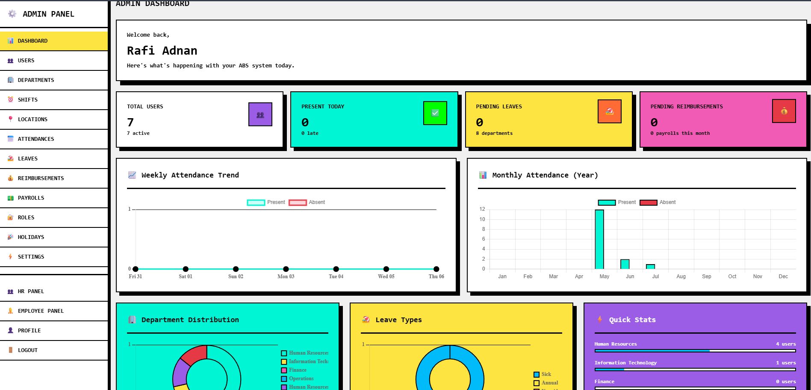
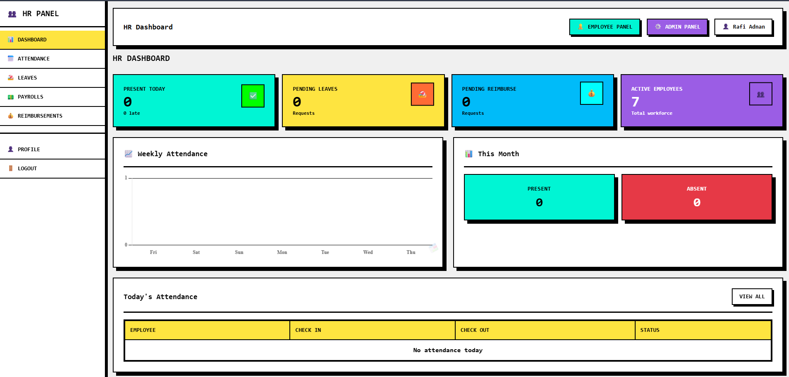
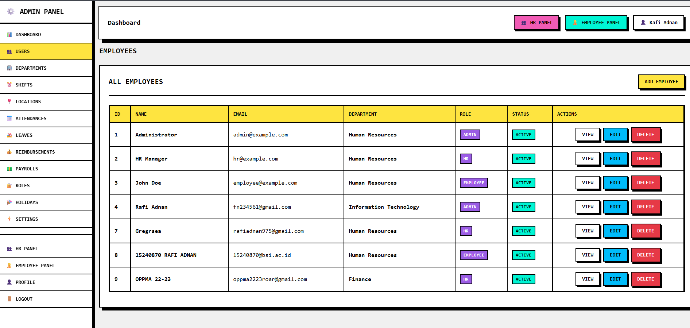
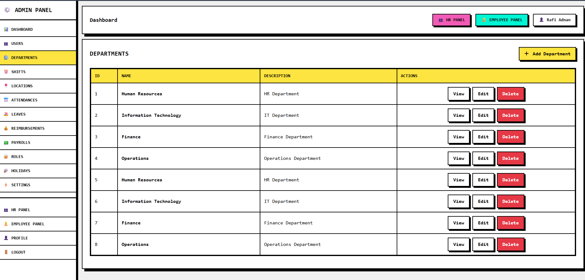
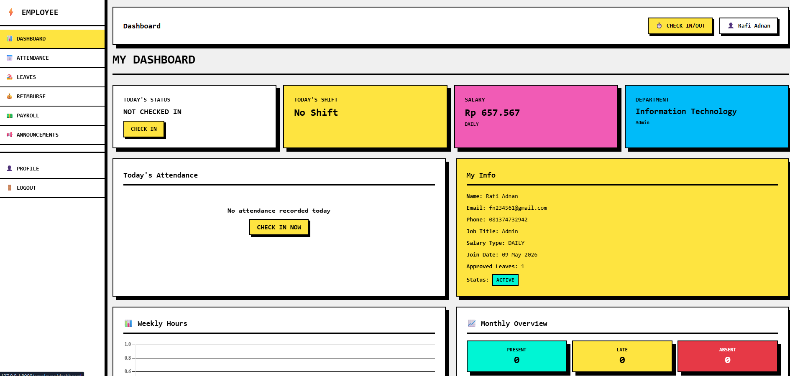
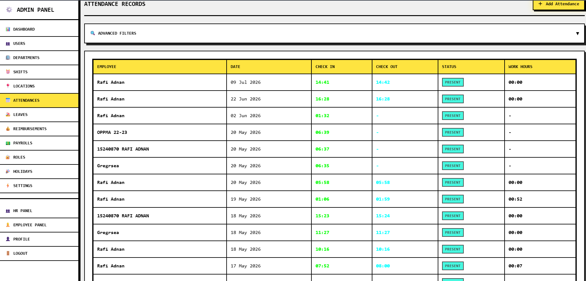
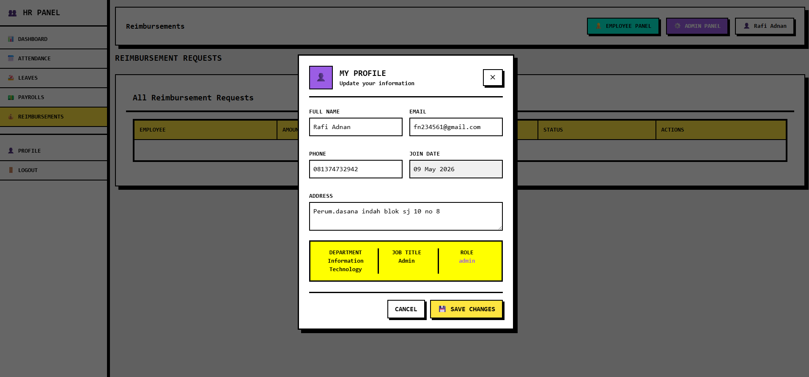
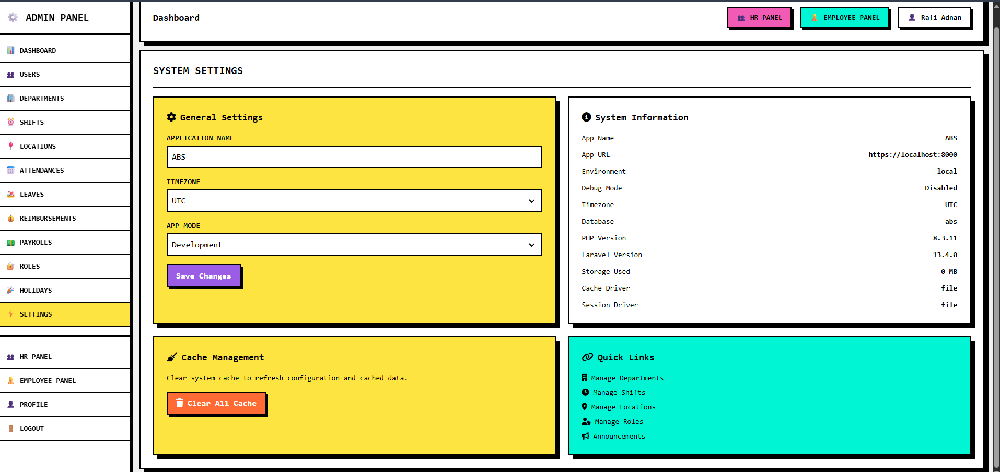
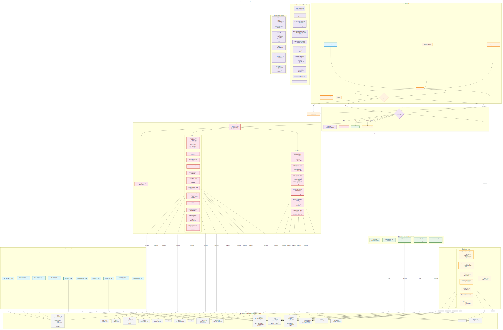

# ABS - Attendance & Employee Management System

<p align="center">
  
  
  
  
  
</p>

## Overview

**ABS (Attendance & Employee Management System)** is a comprehensive, production-ready web application for managing employee attendance, leaves, payroll, and reimbursements. Built with Laravel 13, Tailwind CSS, Alpine.js, and Leaflet for GPS location tracking.

## Table of Contents

- [Features](#features)
- [Screenshots](#screenshots)
- [Technology Stack](#technology-stack)
- [Architecture](#architecture)
- [Database Schema (ERD)](#database-schema-erd)
- [Installation](#installation)
- [Location Tracking](#location-tracking)
- [Default Roles](#default-roles)
- [Project Structure](#project-structure)
- [Security Features](#security-features)
- [Production Deployment](#production-deployment)
- [CI/CD Pipeline](#cicd-pipeline)
- [Known Limitations](#known-limitations)
- [License](#license)

## Features

### Employee Panel
- **Smart Attendance** - Check-in/check-out with GPS location tracking via Leaflet maps
- **Leave Management** - Request leaves with date range and reason
- **Reimbursements** - Submit expense claims with approval workflow
- **Payroll View** - View salary slips and payment history
- **Announcements** - Stay updated with company announcements

### HR Panel
- **Attendance Monitoring** - View all employee attendance records
- **Leave Approval** - Approve or reject leave requests
- **Reimbursement Approval** - Process employee expense claims
- **Payroll Management** - View and manage payroll records

### Admin Panel
- **User Management** - Create, edit, and manage employee accounts
- **Department Management** - Organize employees by department
- **Role & Permission System** - Granular access control (Admin, HR, Employee)
- **Shift Management** - Configure work schedules and shifts
- **Location Management** - Manage office locations for attendance
- **Holiday Calendar** - Set company holidays
- **Salary Rules** - Configure salary calculation rules
- **Overtime Rules** - Define overtime policies
- **System Settings** - Configure application settings
- **Dashboard Analytics** - Key metrics and reports

## Screenshots

| Admin Dashboard | HR Panel |
|----------------|----------|
|  |  |

| Attendance | Departments |
|-----------|-------------|
|  |  |

| Employee Screen | Records |
|----------------|---------|
|  |  |

| Profile Modal | Settings |
|---------------|----------|
|  |  |

| System Architecture |
|---------------------|
|  |

## Technology Stack

| Layer | Technology |
|-------|-----------|
| Backend | Laravel 13.x (PHP 8.3) |
| Frontend | Tailwind CSS 3.x, Alpine.js 3.x |
| Maps | Leaflet.js (OpenStreetMap) |
| Database | MySQL 8.0+ |
| Authentication | Laravel Breeze + Fortify |
| Icons | Font Awesome 7.0.1 |
| Build | Vite 5.x |

## Architecture

```
abs/
├── app/
│   ├── Http/Controllers/
│   │   ├── Admin/       # Admin panel controllers
│   │   ├── HR/          # HR panel controllers
│   │   ├── Employee/    # Employee panel controllers
│   │   └── Auth/        # Authentication controllers
│   ├── Models/          # Eloquent models
│   └── Providers/       # Service providers
├── resources/views/
│   ├── admin/           # Admin panel views (Blade)
│   ├── hr/              # HR panel views
│   ├── employee/        # Employee panel views
│   └── layouts/         # Shared layouts
├── routes/
│   ├── web.php          # Main routes
│   └── auth.php         # Authentication routes
├── database/
│   ├── migrations/      # 24 migration files
│   └── seeders/         # Database seeders
├── tests/               # PHPUnit tests (12 test files)
└── public/
    ├── assets/          # CSS, JS, images
    └── build/           # Compiled assets
```

**Pattern:** MVC with Blade templates, resource controllers, and service-based authorization (role-based access via middleware).

## Database Schema (ERD)

See [ERD.md](ERD.md) for the complete Entity Relationship Diagram with Mermaid visualization.

### Key Tables
- **users** - Core user table with profile, employment, and auth info
- **departments** - Organizational departments
- **job_titles** - Job positions/titles
- **roles** - User roles (Admin, HR, Employee)
- **attendances** - Daily attendance records
- **attendance_logs** - Detailed check-in/out logs with GPS
- **leaves** - Leave requests and approvals
- **payrolls** - Payroll periods and totals
- **reimbursements** - Expense claims
- **locations** - Office locations for GPS check-in
- **shifts** - Work shift definitions

### Relationships
- User → Department/Job Title/Role: Many-to-One
- User → Attendance: One-to-Many (daily records)
- User → Leaves: One-to-Many (leave requests)
- Payroll → Payroll Details: One-to-Many
- Role → Permissions: Many-to-Many

## Installation

### Prerequisites
- PHP 8.3+
- Composer 2.x
- Node.js 18+
- MySQL 8.0+

### Steps

1. **Clone the repository**
   ```bash
   git clone https://github.com/Rafiadnan0666/absen-laravel.git
   cd absen-laravel
   ```

2. **Install PHP dependencies**
   ```bash
   composer install
   ```

3. **Install NPM dependencies**
   ```bash
   npm install
   ```

4. **Configure environment**
   ```bash
   cp .env.example .env
   ```
   
   Edit `.env` with your database credentials:
   ```
   DB_CONNECTION=mysql
   DB_HOST=127.0.0.1
   DB_PORT=3306
   DB_DATABASE=your_database_name
   DB_USERNAME=your_username
   DB_PASSWORD=your_password
   ```

5. **Generate application key**
   ```bash
   php artisan key:generate
   ```

6. **Run migrations**
   ```bash
   php artisan migrate
   ```

7. **(Optional) Seed database with sample data**
   ```bash
   php artisan db:seed
   ```

8. **Build frontend assets**
   ```bash
   npm run build
   ```

9. **Start the development server**
   ```bash
   php artisan serve
   ```

10. **Access the application**
    - Visit: `http://localhost:8000`
    - Login to access the dashboard

## Location Tracking

The system includes GPS-based attendance tracking using Leaflet maps and OpenStreetMap:

- Employees can get their current location using the "Get My Location" button
- Location is displayed on an interactive map
- Coordinates are stored with attendance records
- Supports both check-in and check-out location tracking

## Default Roles

| Role | Access Level |
|------|-------------|
| Admin | Full system access |
| HR | HR management and approvals |
| Employee | Standard user access |

## Project Structure

```
abs/
├── app/
│   ├── Http/Controllers/
│   │   ├── Admin/       # Admin panel controllers
│   │   ├── HR/          # HR panel controllers
│   │   ├── Employee/    # Employee panel controllers
│   │   └── Auth/        # Authentication controllers
│   ├── Models/          # Eloquent models
│   └── Providers/       # Service providers
├── resources/views/
│   ├── admin/           # Admin panel views
│   ├── hr/              # HR panel views
│   ├── employee/        # Employee panel views
│   └── layouts/         # Shared layouts
├── routes/
│   ├── web.php          # Main routes
│   └── auth.php         # Authentication routes
├── database/
│   ├── migrations/      # Database migrations
│   └── seeders/         # Database seeders
└── public/
    ├── assets/          # CSS, JS, images
    └── build/           # Compiled assets
```

## Security Features

- Role-based access control (RBAC)
- Password hashing with bcrypt
- CSRF protection
- XSS protection
- SQL injection prevention
- Account status management (active/inactive)
- Session-based authentication

## Production Deployment

1. **Configure environment**
   ```bash
   # In .env file
   APP_ENV=production
   APP_DEBUG=false
   ```

2. **Optimize Laravel**
   ```bash
   php artisan config:cache
   php artisan route:cache
   php artisan view:cache
   php artisan optimize
   ```

3. **Configure web server**
   
   For Apache, ensure `.htaccess` is configured properly. For Nginx, configure your server block to point to the `public` directory.

4. **Set proper permissions**
   ```bash
   chmod -R 775 storage bootstrap/cache
   ```

## CI/CD Pipeline

GitHub Actions runs daily at 06:00 UTC and on every push to `main`:

- Install dependencies (`composer install`, `npm install`)
- Setup MySQL database
- Run migrations
- Seed database
- Run PHPUnit tests
- Run payroll anomaly check
- Report PASS / FAIL

See `.github/workflows/test.yml` for the pipeline configuration.

## Known Limitations

| Limitation | Impact | Workaround |
|------------|--------|------------|
| **No JWT/OAuth** | Session-based auth only; no API token authentication | Add API token middleware for mobile apps |
| **No pagination** | List endpoints return all records | Add pagination to controllers |
| **No rate limiting** | No request throttling on public routes | Add rate limiter middleware |
| **GPS tolerance** | Location check-in uses fixed radius | Make tolerance configurable |
| **Single-file config** | Some business logic in controllers | Extract to service classes |
| **No email queue** | Mail sent synchronously | Configure queue worker |
| **Neo-brutalism design** | Heavy CSS shadows may not render consistently | Test on target devices |
| **No 2FA** | No two-factor authentication | Add 2FA package |
| **Payroll confirmation** | Manual status changes only | Add automated workflow |

## License

MIT License.

## Support

For issues and feature requests, please create an issue on GitHub.